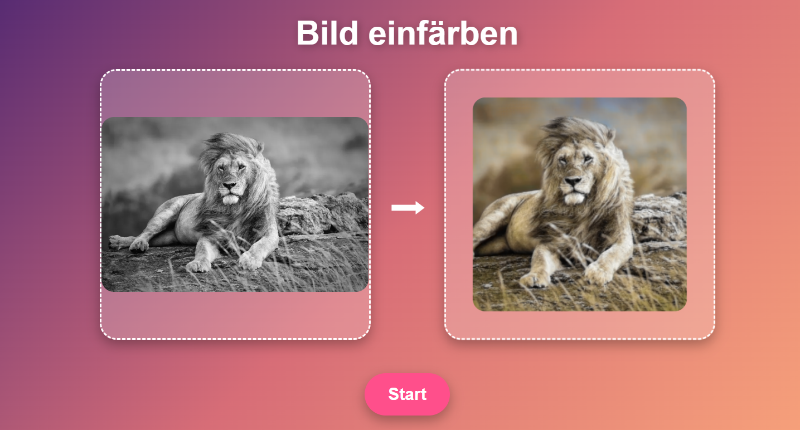
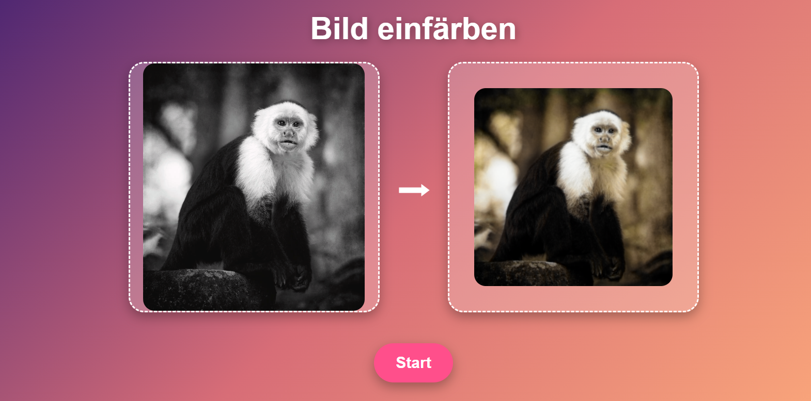

# JAX Image Colorization

A UNet implementation for automatic image colorization using JAX and Flax.

## Setup Instructions (Training)

```bash
git clone https://github.com/Luca-Mezger/image_coloring_unet.git
cd image_coloring_unet
```

### Windows
- Run `setup.bat` (double-click it or execute via Command Prompt). This will create a virtual environment and install all dependencies.
```bash
source venv/bin/activate
```

### Linux
- Run `setup.sh`
```bash
chmod +x setup.sh 
./setup.sh 
source venv/bin/activate
```

## Usage
You need sufficiently powerful hardware to train the model effectively.
1. Check if JAX recognises and is able to use your GPU. Training with a CPU is theoretically possible but no usable results will be achieved in reasonable time.
```bash
python check_jax_gpu.py
```
2. If Jax falls back to CPU you need to install Cuda enabled Jax and Jaxlib. For cuda 11 you have to change the 12 to 11.
```bash
pip uninstall -y jax jaxlib
pip install --upgrade pip
pip install "jax[cuda12_pip]" -f https://storage.googleapis.com/jax-releases/jax_cuda_releases.html

```
3. run get_images.py
You can specify the parameters either through the get_images.py file directly or through argparse:
```bash
python data/get_images.py --dataset STL10 --save_folder ./data/images --num_images 1000 --img_size 256
```
```bash
python data/get_images.py --help
```
4. Optionally run enhance_saturation.py
To reduce dullness of colors in the trained model you can enhance the saturation of all images in a folder and use it as the training folder:
```bash
python enhance_saturation.py --input_dir data/images --output_dir data/images_saturated --saturation 1.8
```
5. run main.py
You can specify the parameters either through the config.py file or through argparse:
```bash
python main.py --batch_size 16 --img_size 128 --epochs 20 --learning_rate 0.0005 --seed 1234 --checkpoint_path checkpoints/new_model.pkl
```
```bash
python main.py --help
```

## Setup Instructions (Inference)
```bash
python inference.py --checkpoint checkpoints/model.pkl --input test/image_4_black_white.png
```
```bash
python inference.py --help
```

## Webapp
Specify the Model used in inference.py
```bash
python app.py
```
Open http://127.0.0.1:5000/

## Demo
<p align="center">
  
</p>
<p align="center">
  
</p>

## ToDo
ToDo:
    - Proper Training with Hyperparameter tuning
    - Test and Eval dataset
    - Better and more datasets (STL10 not optimal for coloring task)

## File Structure
📂 data
📄 .gitignore
📄 check_jax_gpu.py
📄 config.py
📄 datasets.py
📄 enhance_saturation.py
📄 eval.py
📄 inference.py
📄 main.py
📄 model.py
📄 readme.md
📄 requirements.txt
📄 setup.bat
📄 setup.sh
📄 train.py
📄 utils.py
